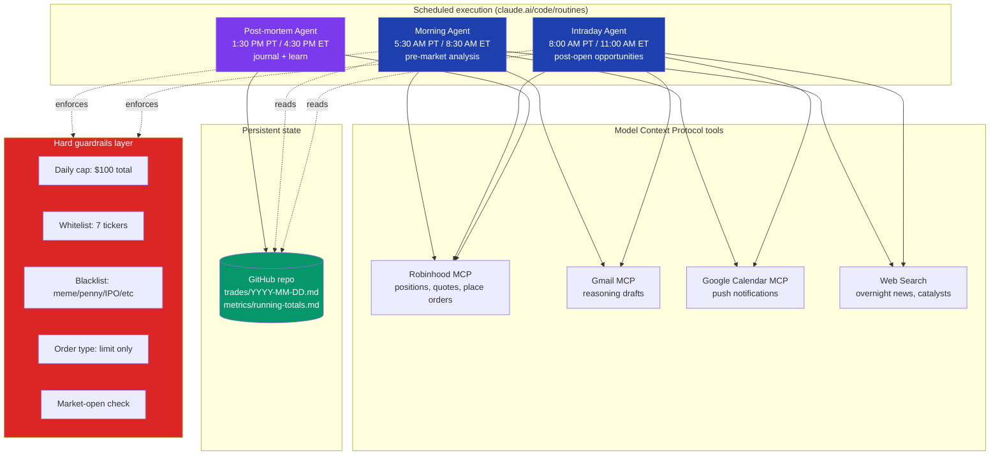

# Multi-Agent Trading System

> Production-deployed autonomous trading system built on Anthropic's Claude Code platform. Three coordinated LLM agents make real-money trades on a brokerage account under strict financial guardrails, with a closed feedback loop that ingests its own track record to improve over time.

[]() []() []()

---

## The problem

Manual pre-market research takes 30–60 minutes a day. By the time you've read overnight news, checked futures, scanned your watchlist for catalysts, and made a decision, the open has already happened. You either skip the prep (and trade reactively) or you skip the trade (and miss the setup).

**Goal:** wake up to a fully-reasoned trade ticket — or an explicit "stand aside" — with the order already placed and a phone notification waiting. Same workflow at midday for setups that only emerge after the open. End the day with a post-mortem that the next morning's agent reads.

## The system



## Architecture in one paragraph

Three Claude Code Remote (CCR) sessions fire on cron schedules. Each agent starts cold with a specific prompt, queries the user's Robinhood account via MCP for current state, performs its analysis (web search for catalysts, real-time quotes), decides ONE action under hard guardrails, executes via the same MCP, then writes a structured journal entry to this GitHub repo. The next morning's agent reads the last 14 days of journal entries before deciding, closing the feedback loop. No local infrastructure — everything runs on Anthropic's scheduling stack and is recoverable by re-running the agents.

## Why this is interesting engineering

- **Multi-agent coordination without RPC** — agents coordinate via the brokerage's order state (`get_equity_orders` is the shared bus) and the GitHub journal. No queue, no service mesh, no shared memory.
- **Trust boundaries** — LLM reasoning can drift, so safety is enforced at three layers: (1) prompt-level rules, (2) per-trade dollar caps enforced by reading account state, (3) Robinhood's server-side validation. Each layer is independent of the others.
- **Closed-loop learning without training** — the system "learns" by accumulating its own journal and re-reading it. No model fine-tuning, no labeled data, no infrastructure. Just structured markdown that the next agent ingests as context.
- **Production constraints on real money** — every design choice has skin in the game. Pre-trade review calls, idempotency keys, holiday detection, and budget tracking aren't theoretical — they prevent real losses.

## Tech stack

| Layer | Choice | Why |
|---|---|---|
| Agent runtime | Anthropic Claude Code Remote (CCR) | Managed cron + isolated execution, no infra |
| LLM | Claude Sonnet 4.6 | Strong tool use + reasoning, lower cost than Opus |
| Tooling | Model Context Protocol (MCP) | Standard interface to Robinhood / Gmail / Calendar |
| Brokerage | Robinhood agentic account | Native MCP with `agentic_allowed` flag |
| State | This GitHub repo | Free, version-controlled, human-readable |
| Notifications | Google Calendar event | Native phone push, already authorized |
| Scheduling | Cron expressions | Five-field UTC, weekday-only |

## Repository structure

```
.
├── README.md                   ← you are here
├── docs/
│   ├── architecture.md         ← detailed component breakdown
│   ├── guardrails.md           ← the safety philosophy + every rule
│   └── decisions.md            ← architecture decision records (why these choices)
├── agents/
│   ├── morning.md              ← morning agent's full prompt (versioned)
│   ├── intraday.md             ← intraday agent's full prompt
│   └── postmortem.md           ← post-mortem agent's full prompt
├── trades/
│   ├── README.md               ← daily journal format spec
│   └── YYYY-MM-DD.md           ← one file per trading day (auto-generated)
└── metrics/
    └── running-totals.md       ← P&L, win rate, vs-SPY benchmark (auto-updated)
```

## Live operation

| Routine | Cron (UTC) | Local fire (PT) | Local fire (ET) |
|---|---|---|---|
| Morning | `30 12 * * 1-5` | 5:30 AM | 8:30 AM |
| Intraday | `0 15 * * 1-5` | 8:00 AM | 11:00 AM |
| Post-mortem | `30 20 * * 1-5` | 1:30 PM | 4:30 PM |

## Results

Will populate as the system accumulates real data. Targets to track:

- Total return vs. SPY benchmark over same window
- Win rate (trades closed profitably / total trades)
- Decision accuracy (stand-aside correctness measured against next-day action)
- Average $ deployed per day vs. $100 cap
- Number of guardrail-triggered aborts (counts as "wins" — system caught itself)

See [`metrics/running-totals.md`](./metrics/running-totals.md) for live numbers.

## Reading the daily journal

Each trading day produces one file: `trades/YYYY-MM-DD.md`. See [`trades/README.md`](./trades/README.md) for the schema. Files are designed to be both human-readable and machine-parseable — the next morning's agent ingests them as context to improve its decisions.

## Engineering tradeoffs deliberately made

- **Multiple agents over one big agent** — three focused prompts vs. one monster prompt. Each agent has less context to manage and clearer success criteria.
- **GitHub over a database** — Markdown files vs. Postgres. Loses query speed; gains zero ops, human readability, and version history for free.
- **Hard caps over stop-losses** — a $100 daily ceiling is simpler and more robust than per-trade stops. Worst-case loss is bounded before the trade is placed.
- **Limit orders only** — gives up immediate fills for price certainty. Small-account economics make slippage matter more than fill speed.
- **Stand-aside is a first-class output** — most production trading systems force a position. Here, "no" is the default and "yes" requires positive proof.

## Acknowledgements

Built on:
- Anthropic [Claude Code](https://claude.com/claude-code) and [Claude Code Remote](https://claude.ai/code) infrastructure
- The [Model Context Protocol](https://modelcontextprotocol.io)
- Robinhood's [agentic trading MCP](https://agent.robinhood.com/mcp/trading)

## License

MIT. Use at your own financial risk. This is a personal research project, not financial advice.
